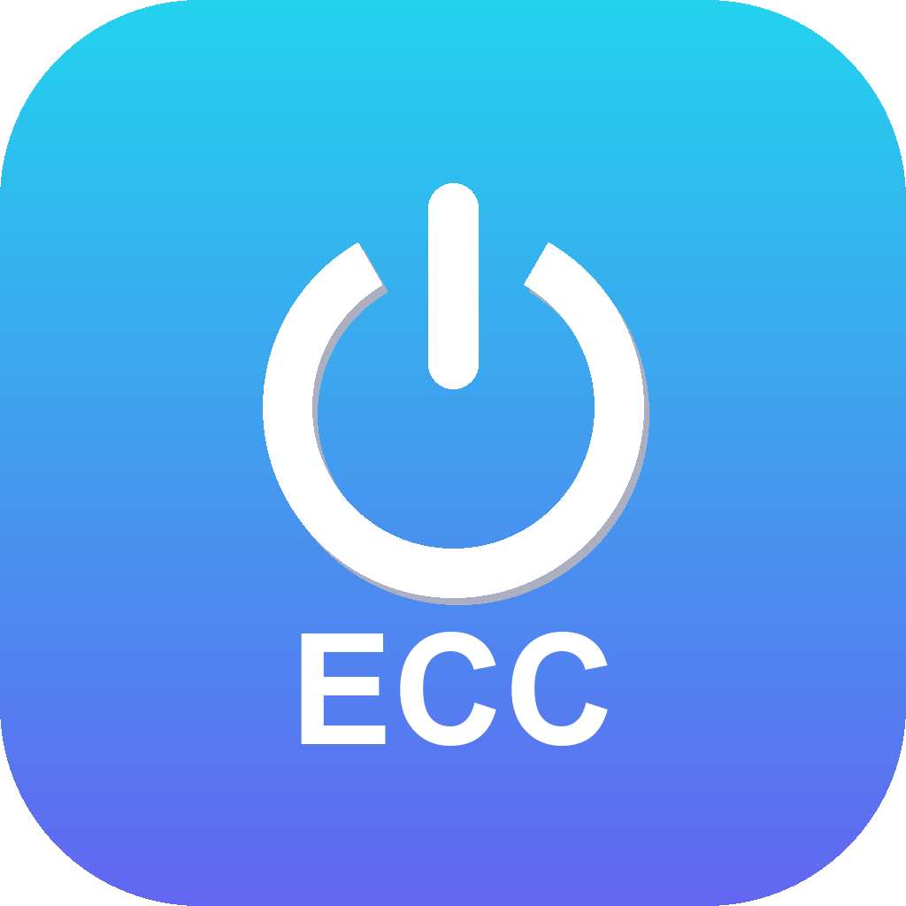

<p align="center">
  
</p>

# ECC Enable Local tool

> 把 [affaan-m/ECC](https://github.com/affaan-m/ECC)（"Everything Claude Code"）**按项目**启用/停用的本地小工具。
> 全局默认**禁用**，只在你需要的项目里一键启用；同时支持 **Claude Code** 与 **Codex**，二者互不影响。

一个带小窗口界面的 Windows 工具（`.exe`），也可作为 Python CLI 使用。

---

## 它解决什么问题

ECC 功能强大，但默认是"全局铺开"。很多时候你**只想在个别项目里用它**，而不想让所有项目都被它影响。
本工具实现：

- **全局保持干净**：从不写 `~/.claude` / `~/.codex`，不启用 ECC 插件。
- **项目内开关**：进某个项目 → 一键部署；不想要了 → 一键停用，且只删自己创建的文件。
- **Claude / Codex 互不冲突**：二者读不同名的文件，天然隔离。

| | Claude Code | Codex |
|---|---|---|
| 指令文件 | `CLAUDE.md`（不读 AGENTS.md）| `AGENTS.md`（不读 CLAUDE.md）|
| 配置目录 | `.claude/` | `.codex/` |
| 启用动作 | 调 ECC 的 `install.ps1 --target claude-project` | 复制 `.codex/` + 动态裁剪 MCP |

> ⚠️ 这个工具是 ECC 的**独立外挂/编排器**，不是 ECC 本身。Codex 端用纯 Python 完成；Claude 端会调用 ECC 自带的 `install.ps1`（底层 pwsh + node，ECC 本来就依赖）。

---

## 特性

- 🪟 **小窗口 GUI**（tkinter）：选 ECC 路径、选项目路径、勾选 Harness、一键部署/停用。
- 🔌 **动态 MCP 识别**：从 `config.toml` **实际存在**的服务器动态枚举；已知的按"是否需要 key"给建议，**未知（ECC 新增）默认保留并标注**，绝不静默丢。
- 🩺 **Self-Check 体检**：校验 ECC 接口、依赖（pwsh/node/git）、profile、版本、以及"全局禁用"不变式。
- 🚀 **一键部署 / 停用 / DryRun 预览**。
- 🛟 **安全卸载**：部署写 `.ecc-local.json` 清单；停用只删本工具创建的东西，已存在的同名目录先备份。
- 🔄 **一键更新 ECC**：`git pull` + `npm install` + 变更摘要。

---

## 依赖与平台

- Windows + PowerShell 7（`pwsh`）
- **Claude 端**需要 `pwsh` + `node`（ECC 安装器要用）
- **更新 ECC** 需要 `git`
- 直接用 `.exe` 则无需安装 Python；从源码运行需 Python 3.12（自带 tkinter）

---

## 获取与运行

### 方式 A：下载 exe（推荐）
到本仓库 **Releases** 下载 `ECC-Enable-Local-tool.exe`，双击运行。
下载链接（始终最新版）：https://github.com/RyanChenJJH/ECC-Enable-Local-tool/releases/latest/download/ECC-Enable-Local-tool.exe

### 方式 B：从源码运行
```powershell
git clone https://github.com/RyanChenJJH/ECC-Enable-Local-tool.git
cd ECC-Enable-Local-tool
py -3.12 -m venv .venv
.\.venv\Scripts\python -m pip install -r requirements.txt
.\.venv\Scripts\python ecc_local_gui.py      # 启动 GUI
```

---

## 界面用法

启动后是一个小窗口，从上到下设置以下参数，最后点按钮执行。

### 路径
| 控件 | 作用 | 怎么设 |
|---|---|---|
| **ECC 仓库** | 指向本地克隆的 ECC 源 | 点「浏览…」选目录；默认自动猜同级 `..\ECC`，并记住上次选择 |
| **项目目录** | 要启用/停用 ECC 的目标工程根 | 点「浏览…」选你的项目根目录 |

### Claude Code
| 控件 | 作用 | 怎么设 |
|---|---|---|
| **启用 Claude** | 是否对 Claude 部署 | 勾选框 |
| **profile** | 安装规模（装多少 agents/hooks/commands），从 ECC 的 `manifests` **动态读取** | 下拉：`minimal`(最轻) / `core`(推荐) / `developer` / `security` / `research` / `full`(全量最重) |
| **rules（可多选）** | 复制到项目 `.claude/rules/ecc/` 的**编码规范集**，Claude 据此遵循对应规范 | 在列表里**逐项点击切换选中**（可多选，再点取消）；默认已选 `common` |

**rules 怎么选、选什么：**
- `common` — 语言无关的通用工程规范（建议总是选上）。
- `python` / `typescript` / `golang` / `java` / `rust` / `react` / `web` … — 对应语言/框架的规范，**选你这个项目实际用到的**。
- `zh` — 中文输出/沟通规范。
- 例：一个 Python + 前端项目可选 `common, python, web, zh`。选得越多加载的规范越多（上下文开销略增），按需即可。

### Codex
| 控件 | 作用 | 怎么设 |
|---|---|---|
| **启用 Codex** | 是否对 Codex 部署 | 勾选框 |
| **档位①（仅指令）** | 只放 `AGENTS.md`，不动你平时的运行策略/MCP（最稳）| 单选 |
| **档位②（整个 .codex/）** | 复制 `config.toml`+agents+AGENTS.md，含 MCP/profile（功能全）| 单选 |
| **用 AGENTS.override.md** | 让本项目指令**覆盖**全局 `~/.codex/AGENTS.md`（而非叠加）| 勾选框 |
| **保留 playwright** | 默认裁掉 playwright（较重）；勾上则保留 | 勾选框 |
| **扫描 MCP（动态识别）** | 读 ECC 的 `.codex/config.toml`，**动态列出**所有 MCP 服务器并给保留建议 | 选档位②后点此；列表里**勾选=保留**，取消=部署时裁掉 |

> MCP 建议规则：无需 key 的（`context7`/`memory`/`sequential-thinking`）默认保留；`github`/`exa` 仅在检测到对应环境变量时保留；`playwright` 默认裁掉；**未知/ECC 新增的服务器默认保留并标注**。

### 操作按钮
| 按钮 | 作用 |
|---|---|
| **体检 Self-Check** | 检查 ECC 接口 / 依赖(pwsh·node·git) / profile / 版本 /「全局禁用」不变式 |
| **预览 DryRun** | 只打印将要做什么，不写任何文件 |
| **一键部署** | 按以上设置真正部署到项目 |
| **停用** | 移除本项目内由本工具创建的 ECC 文件（安全，不误删你自己的）|
| **更新 ECC** | 对 ECC 仓库 `git pull` + `npm install`，并列出 MCP / profile 变更 |

下方**日志窗格**实时显示每一步；底部状态栏显示忙/闲。

> Codex 档位② 首次在项目里运行 `codex` 时，**务必"信任该项目"**，否则项目级 `.codex/config.toml` 不会生效。

---

## CLI 用法（可选，给脚本化/CI）

```powershell
$py = ".\.venv\Scripts\python"
& $py ecc_local_cli.py on   --project D:\proj                 # Claude+Codex(档位①)
& $py ecc_local_cli.py on   --project D:\proj --codex-full    # Codex 档位②(自动裁 MCP)
& $py ecc_local_cli.py on   --project D:\proj --harness claude --profile full --rules common,zh
& $py ecc_local_cli.py selfcheck --project D:\proj
& $py ecc_local_cli.py off  --project D:\proj
& $py ecc_local_cli.py update                                 # 更新 ECC
```

---

## 动态 MCP 裁剪规则

档位② 复制进项目的 `.codex/config.toml` 会被裁剪（**只改项目副本，不动全局**）：

| 类型 | 默认 | 条件 |
|---|---|---|
| 无需 key（`sequential-thinking` / `memory` / `context7`）| 保留 | — |
| `github` | 视情况 | 检测到 `GITHUB_PERSONAL_ACCESS_TOKEN` / `GITHUB_TOKEN` / `GH_TOKEN` 才保留 |
| `exa` | 视情况 | 检测到 `EXA_API_KEY` 才保留 |
| `playwright` | 移除 | 较重（浏览器扩展），勾"保留 playwright"才留 |
| **未知（ECC 新增）** | **保留** | 高亮标注，交由你决定 |

Windows 下还会自动移除 ECC 配置里依赖 macOS `terminal-notifier` 的 `notify` 设置。

---

## ECC 更新会不会影响工具？

分两层：

| 更新类型 | 例子 | 工具要不要改 |
|---|---|---|
| **内容更新**（数据）| 新增/改 agents、skills、rules、**MCP server**、**profile** | **不用**。profile 从 `manifests/install-profiles.json` 读、MCP 从 `config.toml` 枚举，全部运行时动态读取 → 点 **更新 ECC** 即自动适配。|
| **结构性大改**（契约）| 重命名 `install.ps1`、改 `--target`/profile 机制、重排 `.codex` 布局 | 罕见。此时 **Self-Check 会精确报出哪条假设破了**，再更新工具本身即可。|

**结论**：日常更新一键完成；只有 ECC 偶发大版本结构调整才需要更新工具，且工具会主动提示。

---

## 从源码构建 exe

```powershell
.\build.ps1
# 产物：dist\ECC-Enable-Local-tool.exe
```
或打 `v*` tag 触发 GitHub Actions 自动构建并发布到 Release（见 `.github/workflows/build.yml`）。

---

## 目录结构

```
ECC-Enable-Local-tool/
├─ ecc_local/            # 核心包
│  ├─ eccrepo.py         # ECC 仓库模型 + 动态 profile/rules/version
│  ├─ mcp.py             # 动态 MCP 识别 + tomlkit 裁剪
│  ├─ deploy.py          # 启用/停用/备份/清单（Claude + Codex）
│  ├─ selfcheck.py       # 体检
│  ├─ update.py          # 一键更新 ECC
│  ├─ gui.py             # tkinter 界面
│  ├─ cli.py             # 命令行
│  ├─ proc.py / log.py / settings.py
├─ ecc_local_gui.py      # GUI 入口（打包成 exe）
├─ ecc_local_cli.py      # CLI 入口
├─ legacy/               # 旧的 PowerShell 脚本与手册（归档）
├─ build.ps1  requirements.txt  .github/workflows/build.yml
└─ README.md  LICENSE
```

---

## 安全与隐私

- **绝不动全局**：所有写操作都在你选定的项目目录内。
- **密钥**：ECC 的 MCP 走环境变量；不要把含明文 key 的 `config.toml` 提交到 git。
- **Git 卫生**：建议把 `.ecc-local.json` / `.claude/` / `.codex/` / `AGENTS*.md` 加入项目的 `.gitignore`。
- **备份**：部署若发现项目已有非本工具创建的同名目录，会先备份到 `.ecc-backup/<时间戳>/`。

---

## 许可证与归属

本工具以 **MIT** 许可（见 [LICENSE](LICENSE)）。

本工具只是 [affaan-m/ECC](https://github.com/affaan-m/ECC) 的独立外挂，**ECC 本身的版权归其原作者**，请遵循 ECC 仓库各自的许可证。旧版 PowerShell 实现见 [`legacy/`](legacy/)。
